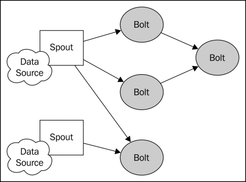

# 第一章 分布式单词记数
本章，主要介绍使用storm开发分布式流处理应用的基本概念。我们将构建一个统计持续流动的句子中单词个数的简单应用。通过本章的学习，你将了解到设计一个复杂流计算系统所学需要的多种结构，技术和模式。

我们将首先介绍Storm的数据结构，接下来实现一个完全成熟的Storm应用的各个组件。本章结束,你将基本了解Storm计算结构,搭建开发环境,掌握开发和调试storm应用程序的基本技术。

本章包括以下主题:
·Storm的基本结构——topologies, streams, spouts, and bolts
·建立Storm的开发环境
·实现一个基本的单词计数应用程序
·并行化和容错
·并行计算任务扩展

###介绍的Storm拓扑的基本元素——streams, spouts, and bolts

在Storm中,分布式计算的结构被称为一个拓扑，它由流数据,Spouts(流生产者),以及Bolt(操作)组成。Storm拓扑大致类似于批处理作业，例如Hadoop处理系统等。然而,批作业都清楚定义了任务开始和结束点,Strom拓扑确一直运行下去,直到显式地kill或解除部署。

####Streams

Storm的核心数据结构是元组。元组是一个简单的命名值列表(键-值对),流是一个无界元组序列。如果你s熟悉复杂事件处理(CEP),你可以把Storm元组看作是事件。