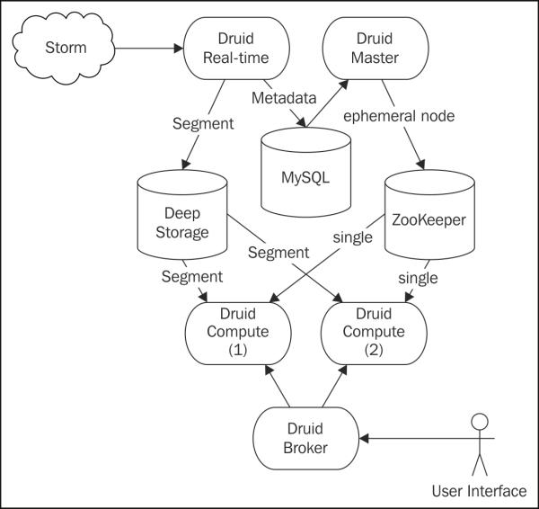
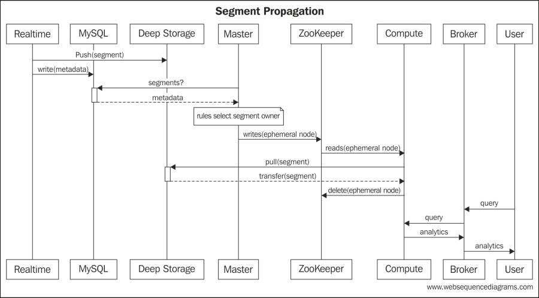
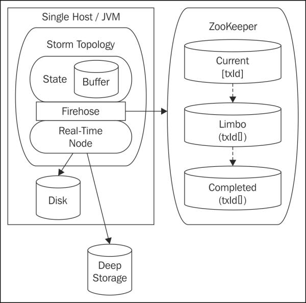
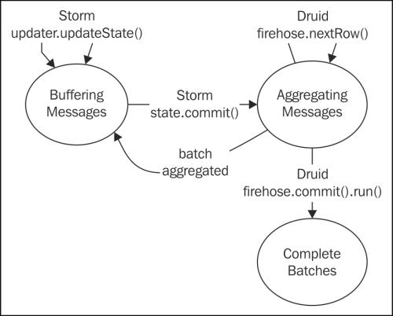

#第七章 集成Druid进行金融分析 

在这一章,我们将扩展使用Trident来创建一个实时金融分析仪表盘。该系统将处理金融消息提供各级粒度股票价格信息随着时间的推移。系统将展示与事务性系统集成，使用自定义状态实现。

在前面的示例中,我们使用Trident统计过去一段时间运行事件的总数。这个简单的例子充分说明了分析一位数据,但是架构设计不灵活。引入一个新的维度需要重新Java开发和部署新的代码。

传统上,数据仓库技术和商业智能平台是用于计算和存储空间分析。仓库部署的联机分析处理(OLAP)系统,与在线事务处理(OLTP)分离。数据传播到OLAP系统,但通常有一些滞后。这是一个足够的回顾性分析模型,但不满足的情况下,需要实时分析。

同样,其他方法使用批处理技术产生了数据科学家。数据科学家使用Pig语言来表达他们的查询。然后,这些查询编译成工作,运行在大型的数据集上。幸运的是,他们运行在Hadoop等分布式平台上跨多台机器处理,但这仍然引入了大量的延迟。

这两种方法对金融系统都不适应,这种滞后的可用性分析系统不能热搜。仅旋转一个批处理工作开销可能太多的延迟的实时金融体系的要求。

在这一章,我们将扩展我们的Storm的使用来提供一个灵活的系统,引入新的维度,仅需要很少的努力
同时提供实时分析。我们的意思是说,只有一个短延迟数据摄入和可用性之间的维度分析。

在这一章,我们将讨论下列主题:

1. 定制状态实现
1. 与非事务性存储的集成
1. 使用Zookeeper保存分布式状态
1. Druid和实时汇总分析

##用例

在我们的用例中,我们将利用一个金融体系中股票的订单。使用这些信息,我们将提供随着时间的推移的价格信息,这是可以通过表示状态传输(REST)接口来完成。

在金融行业规范化消息格式是金融信息交换(FIX)格式。这种格式的规范可以参考: http://www.fixprotocol.org/。

An example FIX message is shown as follows:
一个FIX信息的例子如下:

	23:25:1256=BANZAI6=011=135215791235714=017=520=031=032=037=538=1000039=054=155=SPY150=2151=010=2528=FIX.4.19=10435=F34=649=BANZAI52=20121105-

FIX信息本质上是键-值对流。ASCII字符01,表示开始信息头开始(SOH)。FIX是指键作为标记。如前面所示信息,标签被识别为整数。每个标签都有一个关联的字段名称和数据类型。一个完整的
参考标记类型可访问 http://www.fixprotocol.org/FIXimate3.0/en/FIX.4.2/fields_sorted_by_tagnum.html。

用例的重要字段如下表所示:

<table>
    <tbody>
       <tr><th><em>Tag ID</em></th><th><em>Field name</em></th><th><em>Description</em></th><th><em>Data type</em></th></tr>
       <tr><td>11</td><td>CIOrdID</td><td>This is the unique identifier for message.</td><td>String</td></tr>
       <tr><td>35</td><td>MsgType</td><td>This is is the type of the FIX message.</td><td>String</td></tr>
       <tr><td>44</td><td>Price</td><td>This is the stock price per share.</td><td>Price</td></tr>
       <tr><td>55</td><td>Symbol</td><td>This is the stock symbol. </td><td>String</td></tr>
    </tbody>
</table>

FIX是一个TCP/IP协议上的层。因此,在实际系统中,这些消息通过TCP/IP接收。与Storm易于集成，
系统可以是Kafka队列的消息。然而,对于我们的示例,我们只会摄取FIX消息文件。FIX支持多种消息类型。一些是控制消息(例如登录,心跳,等等)。我们将过滤掉这些消息,只传递类型（包括价格信息）到分析引擎。

##实现一个非事务系统

基于扩展前面的例子,我们可以开发一个框架配置允许用户以指定的维度来聚集他们需要的事件。然后,我们可以在我们的拓扑中使用该配置来维护一组内存中的数据集进行累积聚合,但任何内存存储容易故障。为了解决容错系统,我们可以使这些聚合保存在数据库中。

我们需要预测和支持所有不同用户想要完成的类型的聚合(例如,金额、平均、地理空间等)。这似乎是一个很困难的工作。

幸运的是,我们可以选择实时分析引擎。一个流行的开源的选择是Druid。下面的文章是在他们的白皮书（ http://static.druid.io/docs/druid.pdf ）找到的:

Druid是一个开源的、实时分析数据存储,支持快速特别对大规模数据集的查询。系统使用面向列数据布局,无共享架构,高级索引结构,允许任意检索百亿条记录的表达到秒级延迟。Druid支持水平扩展, 使用Metamarkets数据分析平台核心引擎。

从这个摘录看,Druid完全符合我们的要求。现在,面临的挑战是怎么与Storm结合。

Druid的技术堆栈自然符合基于Storm的生态系统。像Storm一样,它使用ZooKeeper协调之间的节点。Druid也支持直接与Kafka的集成。在某些情况下,这可能是合适的。在我们的示例中,为了演示非事务性系统的集成,我们将直接将Druid与Storm集成。

我们这里将包括Druid的简要描述。然而,对于更详细Druid的信息,请参考下面的网站: https://github.com/metamx/druid/wiki

Druid通过实时节点收集信息。基于一个可配置的粒度,Real-time节点收集事件信息,然后永久保存在一个很深的叫做段的存储机制。Druid持续将这些元数据的元数据存储在MySQL。

主节点识别新的段，基于规则确定计算节点段,并通知计算节点的推送到新的段。Broker结点在计算节点的前面,接收其他消费者的REST查询并分发这些查询到适当的计算节点。

因此,,集成了Storm与Druid的一个架构看起来类似于什么下图所示:

如在前面的图中,有三种数据存储机制。MySQL数据库是一个简单的元数据存储库。它包含所有的元数据信息的所有部分。深度存储机制包含实际的段信息。每个段包含一个混合索引为一个特定的事件时间基于维度和聚合在一个配置文件中定义。因此,一个段可以很大大(例如,2 GB blob)。在我们的示例中,我们将使用Cassandra作为深度存储机制。

最后,第三个数据存储机制是ZooKeeper。存储在ZooKeeper是临时的,仅用于控制信息。当一个新的段是可用的,Master节点写一个短暂的节点在ZooKeeper。计算节点订阅了相同的路径,短暂的节点触发计算节点当有新的段时。当段被成功地检索后,计算节点从ZooKeeper删除该节点。

在我们的例子中,整个的事件序列如下:

前面的图展示了Storm事件处理下游。什么是重要的认识在许多实时分析引擎是无法恢复一个事务的。分析系统是高度优化处理速度和聚合过程。牺牲了事务完整性。

如果我们重新审视Trident的状态分类,有三种不同种类的状态:事务、不透明和非事物性。事务状态需要不断持久化每一批的内容。一个不透明的事务状态可以容忍批改写改变随着时间的推移。最后,一个非事务性状态不能保证完全的只处理一次语义。

总结storm.trident.state状态对象的Javadoc,有三种不同的状态:

<table>
    <tbody>
       <tr><td>Non-Transactional state</td><td>In this state, commits are ignored.No rollback can be done.Updates are permanent.</td></tr>
       <tr><td>Repeat Transactional state</td><td>The system is idempotent as long as all batches are identical.</td></tr>
       <tr><td>Opaque Transactional state</td><td>State transitions are incremental. The previous state is stored along with the batch identifier to tolerate changing batch composition in the event of replay.</td></tr>
    </tbody>
</table>

重要的是要意识到引入拓扑的状态要有效的保证任何写入存储的序列。这可能大大影响性能。如果可能的话,最好的方法是确保整个系统是幂等的。如果写都是幂等的,那么你不需要引入事务性存储(或状态),因为架构自然地容忍元组重发。

通常,如果状态的持久性是由你控制的数据库模式,你可以调整模式添加额外的信息参与事务:上次提交的批处理标识符为重复事务和以前的状态不透明的事务。然后,在状态实现时,您可以利用这些信息来确保你的状态对象符合您正在使用的类型Spout。

然而,这并非总是如此,特别是在系统执行聚合,如计数、求和、求平均值等等时。计数器在Cassandra中有这个约束机制。不可能取消一个计数器,并使加法幂等是不可能的。如果一个元组进行重播,计数器再次增加,你最有可能在数量上超过系统中的元素。出于这个原因,任何状态实现了Cassandra计数器是非事务性的支持。

同样,Druid是非事务性的。一旦Druid消费一个事件,事件将无法撤销。因此,如果一批在Storm部分被Druid消费,然后批重播,或成分变化,根本没有维度分析恢复方式。出于这个原因,有趣的是考虑Druid和Storm之间的集成，为了解决回放步骤,这种耦合的力量。

简而言之,Storm连接到Druid,我们将利用的特征事务Spout连接时所说的风险降到最低像Drudi非事务性状态机制。

##拓扑

了解了架构概念后,让我们回到这个用例。为了保持专注于集成,我们将保持拓扑结构简单。下图描述了拓扑:

包含简单FIX消息的FIX Spout发出元组信息。然后过滤给定类型信息,过滤包含价格信息的库存订单。然后,这些过滤的元组流入DruidState对象,与Druid的桥。

这个简单的拓扑结构的代码如下:
	
	public class FinancialAnalyticsTopology {

		public static StormTopology buildTopology() {
	
			TridentTopology topology = new TridentTopology();
			FixEventSpout spout = new FixEventSpout();
			Stream inputStream = topology.newStream("message", spout);
			inputStream.each(new Fields("message"),	new MessageTypeFilter()).partitionPersist(new DruidStateFactory(),new Fields("message"), new DruidStateUpdater());
			return topology.build();
		}
	}

###Spout

有许多FIX消息格式的解析器。在Spout中,我们将使用FIX Parser,这是一个Google项目。更多项目信息,你可以参考 https://code.google.com/p/fixparser/。

就像前一章,Spout本身很简单。它只是返回一个协调器和一个发射器的引用,如下面所示代码:

	public class FixEventSpout implements ITridentSpout<Long> {
		private static final long serialVersionUID = 1L;
		SpoutOutputCollector collector;
		BatchCoordinator<Long> coordinator = new DefaultCoordinator();
		Emitter<Long> emitter = new FixEventEmitter();
		...
		@Override
		public Fields getOutputFields() {
		    return new Fields("message");
		}
	}

正如前面的代码所示,Spout声明一个输出字段:message。这将包含发射器产生的FixMessageDto对象,如以下代码所示:

	public class FixEventEmitter implements ITridentSpout.Emitter<Long>,
	        Serializable {
	    private static final long serialVersionUID = 1L;
	    public static AtomicInteger successfulTransactions = new AtomicInteger(0);
	    public static AtomicInteger uids = new AtomicInteger(0);
	
	    @SuppressWarnings("rawtypes")
	    @Override
	    public void emitBatch(TransactionAttempt tx, Long coordinatorMeta, TridentCollector collector) {
	        InputStream inputStream = null;
	        File file = new File("fix_data.txt");
	        try {
	            inputStream = new BufferedInputStream(new FileInputStream(file));
	            SimpleFixParser parser = new SimpleFixParser(inputStream);
	            SimpleFixMessage msg = null;
	            do {
	                msg = parser.readFixMessage();
	                if (null != msg) {
	                    FixMessageDto dto = new FixMessageDto();
	                    for (TagValue tagValue : msg.fields()) {
	                        if (tagValue.tag().equals("6")) { //AvgPx
	                            // dto.price = Double.valueOf((String) tagValue.value());
	                            dto.price = new Double((int)(Math.random() * 100));
	                        } else if (tagValue.tag().equals("35")) {
	                            dto.msgType = (String) tagValue.value();
	                        } else if (tagValue.tag().equals("55")) {
	                            dto.symbol = (String) tagValue.value();
	                        } else if (tagValue.tag().equals("11")) {
	                            // dto.uid = (String) tagValue.value();
	                            dto.uid = Integer.toString(uids.incrementAndGet());
	                        }
	                    }
	                    new ObjectOutputStream(new ByteArrayOutputStream()).writeObject(dto);
	                    List<Object> message = new ArrayList<Object>();
	                    message.add(dto);
	                    collector.emit(message);
	                }
	            } while (msg != null);
	        } catch (Exception e) {
	            throw new RuntimeException(e);
	        } finally {
	            IoUtils.closeSilently(inputStream);
	        }
	    }
	
	    @Override
	    public void success(TransactionAttempt tx) {
	        successfulTransactions.incrementAndGet();
	    }
	
	    @Override
	    public void close() {
	    }
	}

从前面的代码中,您可以看到,我们把重新解析为每个批次。正如我们前面所述,在实时系统中我们可能会通过TCP / IP接收消息并放入Kafka队列。然后,我们将使用Kafka Spout发出消息。它是一个个人喜好问题;但是,在Storm完全封装数据处理,系统将最有可能从队列获取原始消息文本。在设计中,我们将在一个函数中解析文本而不是Spout中。

虽然这Spout对于这个示例是足够了,注意,每一批的组成是相同的。具体地说,每一批包含所有从文件的消息。因为我们状态的设计依赖于这一特点,在实际系统中,我们需要使用TransactionalKafkaSpout。

###Filter

像Spout,过滤器是非常简单的。它检查msgType对象和过滤不完整订单的消息。完整订单实际上是股票
购买收据。它们包含的均价格,贸易和执行购买股票的符号。下面的代码是过滤消息类型:

	public class MessageTypeFilter extends BaseFilter {
	    private static final long serialVersionUID = 1L;
	
	    @Override
	    public boolean isKeep(TridentTuple tuple) {
	        FixMessageDto message = (FixMessageDto) tuple.getValue(0);
	        if (message.msgType.equals("8")) {
	            return true;
	        }
	        return false;
	    }
	}

这提供了一个很好的机会,指出可串行性的重要性在Storm中。请注意,在前面的代码中过滤操作在一个FixMessageDto对象。这将是更容易简单地使用SimpleFixMessage对象,但SimpleFixMessage对象不是可序列化的。

这不会产生任何问题当运行在本地集群。然而,由于storm在数据处理中元组在主机之间交换,所有的元素在一个元组必须是可序列化的。

###Tip

开发人员经常提交修改元组的数据对象是没有序列化的。这将导致下游部署问题。确保所有元组中的对象是可序列化的,添加单元测试,验证对象是可序列化的。测试是很简单的,使用以下代码:

	new ObjectOutputStream(new ByteArrayOutputStream()).writeObject(YOUR_OBJECT);

###状态设计

现在,让我们继续这个例子的最有趣的方面。为了集成Storm与Druid,我们将嵌入实时服务器在我们的Druid拓扑结构并实现必要的接口连接元组流。为了减少连接到非事务性系统固有的风险,我们利用Zookeepr保存状态信息。持久化不会阻止异常由于失败,但它将有助于确定哪些数据存在风险当发生故障时。

高层设计如下所示:

在高级别上,Storm用一个工厂创建状态对象在workerJVM进程中。每一批次为每个分区创建一个状态对象。状态工厂对象确保实时服务器运行在它返回任何状态对象并启动服务，如果没有运行。状态对象然后将这些消息放入缓冲区,直到Storm要求提交。当Storm调用提交方法师,状态对象解锁Druid Firehose。这将信号发送给Druid,准备数据聚合。然后,我们在storm commit方法中阻塞,而实时服务器开始拉数据通过Firehose。

为了确保每个分区最多被一次处理,我们将为每个分区设置一个分区标识符。分区标识符包括批处理标识符和分区索引,并唯一地标识一组数据,因为我们使用的是事务spout。

在Zookeeper中有三种状态：

<table>
    <tbody>
       <tr><th><em>State</em></th><th><em>Description</em></th></tr>
       <tr><td>inProgress</td><td>This Zookeeper path contains the partition identifiers that Druid is processing.</td></tr>
       <tr><td>Limbo</td><td>This Zookeeper path contains the partition identifiers that Druid consumed in their entirety, but which may not be committed.</td></tr>
       <tr><td>Completed</td><td>This Zookeeper path contains the partition identifiers that Druid successfully committed.</td>
    </tbody>
</table>

当一批是在处理过程中,Firehose写分区标识符到inProgress路径。当Druid把整个Storm分区完全拉取时,分区标识符被移到Limbo,我们释放Storm继续处理当我们等待提交消息从Druid。

当从Druid接收到提交消息后,Firehose移动分区标识符到Completed路径。在这一点上,我们假设数据被写入磁盘。我们仍然容易丢失数据由于磁盘故障。然而,如果我们假设我们可以使用批处理重建的聚合,然后这是最有可能的一个可接受的风险。

以下状态机说明了处理的不同阶段:

如图所示,在缓冲消息和聚合信息之间有一个循环。主要控制回路开关迅速在这两个状态之间转换,分裂storm处理循环和druid聚合循环之间的时间。状态是互斥的:系统聚集一批,或者缓冲下一批。

当Druid的信息写入到磁盘时第三个状态触发。当这种情况发生时(稍后我们将看到),通知Firehose,我们可以更新持久性机制表明该操作被安全地处理。直到在调用之前被Druid提交的批次必须保留在Limbo状态。

而在Limbo状态,没有假设可以对数据改变。Druid可能有也可能没有聚合的记录。

在发生故障时,Storm可能利用其他TridentState实例来完成处理。因此,对于每个分区,Firehose必须执行以下步骤:

1. Firehose必须检查分区是否已经完成。如果是这样,分区是一个重播,很可能由于下游失败。因为批处理是保证有相同的内容,它可以安全地忽略Druid已经聚合的内容。系统可以生成一个警告消息日志。

2. Firehose必须检查分区是否在limbo状态。如果是这样的话,那么Druid完全消费分区,但从不调用提交或提交后系统失效，在Druid更新Zookeepr前。系统应该发出警报。它不应该试图完成一批,因为它完全被Druid消费,我们不知道聚集的状态。它只是返回,使Storm继续处理下一批。

3. Firehose必须检查正在处理的分区。如果是这样的话,那么出于某种原因,在网络上的某个地方,由另一个实例处理分区。这不应该发生在普通处理时。在这种情况下,系统应该为这个分区发出一个警告。在我们的简单系统,我们将简单地处理,忽略它给我们的离线批处理使之能正确的聚合。

在许多大型实时系统,用户愿意容忍轻微差异在实时分析中，只要倾斜是罕见的并且可以很快弥补。

重要的是要注意,这种方法成功是因为我们使用的是事务spout。事务spout保证每一批都有相同的成分。此外,这个方法起作用,每个分区在批处理必须有相同的成分。这是真的当且仅当拓扑分区是确定的。使用确定性分区和事务spout,每个分区将包含相同的数据,即使在事件的重演。我们使用随机分组,这种方法行不通。我们的示例拓扑是确定的。这可以保证一批标识符,加上一个分区索引时,表示一组一致的数据。

##架构实现